# Pushbullet メッセージ分割機能 実装タスク

## 概要

全タスク数: 8
推定作業時間: 4時間
クリティカルパス: TASK-001 → TASK-002 → TASK-003 → TASK-004 → TASK-005 → TASK-006 → TASK-007 → TASK-008

## 機能要件
- 長いメッセージをPushbulletの制限に収まるように分割して送信
- デフォルトの最大文字数を500から1,000文字に変更
- 設定ファイルで最大文字数をカスタマイズ可能
- 分割時は単語境界で分割（単語の途中で切らない）
- 分割メッセージには番号付け（例: [1/3], [2/3], [3/3]）

## タスク一覧

### フェーズ1: 設定と基盤

#### TASK-001: 設定ファイルの更新

- [x] **タスク完了**
- **タスクタイプ**: DIRECT
- **要件リンク**: 最大文字数のカスタマイズ
- **依存タスク**: なし
- **実装詳細**:
  - `config.toml.example` の `max_body_length` デフォルトを 1000 に変更
  - 新しい設定項目 `split_long_messages` を追加（デフォルト: true）
  - 設定項目の説明コメントを追加
- **完了条件**:
  - [ ] デフォルト値が1000に変更されている
  - [ ] `split_long_messages` オプションが追加されている
  - [ ] コメントで機能が説明されている

#### TASK-002: デフォルト値の更新

- [x] **タスク完了**
- **タスクタイプ**: DIRECT
- **要件リンク**: デフォルト値の変更
- **依存タスク**: TASK-001
- **実装詳細**:
  - `__init__.py` の `DEFAULT_MAX_BODY_LENGTH` を 1000 に変更
  - 設定ロード関数で `split_long_messages` のデフォルト値を設定
- **完了条件**:
  - [ ] デフォルト値が正しく設定されている
  - [ ] 設定が正しくロードされる

### フェーズ2: コア機能実装

#### TASK-003: メッセージ分割関数の実装

- [x] **タスク完了**
- **タスクタイプ**: TDD
- **要件リンク**: メッセージ分割ロジック
- **依存タスク**: TASK-002
- **実装詳細**:
  - `_split_message_into_chunks(message, max_length)` 関数を作成
  - 単語境界での分割ロジック実装
  - 各チャンクが最大長を超えないように調整
- **テスト要件**:
  - [ ] 単体テスト: 正確な分割
  - [ ] 単体テスト: 単語境界の保持
  - [ ] 単体テスト: 空文字・短い文字列の処理
- **エラーハンドリング**:
  - [ ] 分割不可能な長い単語の処理
  - [ ] 空文字列の処理

#### TASK-004: 番号付け機能の実装

- [x] **タスク完了**
- **タスクタイプ**: TDD
- **要件リンク**: 分割メッセージの番号付け
- **依存タスク**: TASK-003
- **実装詳細**:
  - 分割されたメッセージに `[1/3]` 形式の番号を付ける
  - タイトルに番号を追加する関数を作成
  - 番号のフォーマットを統一
- **テスト要件**:
  - [ ] 単体テスト: 番号フォーマットの検証
  - [ ] 単体テスト: 単一メッセージの場合（番号なし）
  - [ ] 単体テスト: 複数メッセージの場合

### フェーズ3: API統合

#### TASK-005: 複数通知送信機能の実装

- [x] **タスク完了**
- **タスクタイプ**: TDD
- **要件リンク**: 複数通知の送信
- **依存タスク**: TASK-004
- **実装詳細**:
  - `send_pushbullet_notification` を複数メッセージ対応に拡張
  - 各チャンクを順番に送信
  - 送信間隔の制御（必要に応じて）
- **テスト要件**:
  - [ ] 統合テスト: 複数通知の送信成功
  - [ ] 統合テスト: 部分的な送信失敗の処理
  - [ ] モックテスト: API呼び出しの検証
- **エラーハンドリング**:
  - [ ] 一部送信失敗時の処理
  - [ ] レート制限への対応

#### TASK-006: メイン送信関数の更新

- [x] **タスク完了**
- **タスクタイプ**: TDD
- **要件リンク**: 既存機能との統合
- **依存タスク**: TASK-005
- **実装詳細**:
  - `_send_notification` 関数を更新
  - `split_long_messages` 設定の確認
  - 分割が必要な場合の処理フロー実装
- **テスト要件**:
  - [ ] 統合テスト: 設定による動作切り替え
  - [ ] 統合テスト: テンプレート使用時の動作
  - [ ] 統合テスト: トランスクリプト使用時の動作

### フェーズ4: テストと品質保証

#### TASK-007: 包括的なテストスイートの作成

- [x] **タスク完了**
- **タスクタイプ**: TDD
- **要件リンク**: 品質保証
- **依存タスク**: TASK-006
- **実装詳細**:
  - `test_message_splitting.py` を新規作成
  - エッジケースのテスト（境界値、特殊文字）
  - パフォーマンステスト（大量テキスト）
- **テスト要件**:
  - [ ] 境界値テスト: ちょうど最大長
  - [ ] 境界値テスト: 最大長+1文字
  - [ ] エッジケース: 日本語・絵文字
  - [ ] エッジケース: 改行・特殊文字
  - [ ] パフォーマンス: 10KB以上のテキスト

### フェーズ5: ドキュメント更新

#### TASK-008: ドキュメントの更新

- [x] **タスク完了**
- **タスクタイプ**: DIRECT
- **要件リンク**: ユーザードキュメント
- **依存タスク**: TASK-007
- **実装詳細**:
  - `README.md` に新機能の説明を追加
  - 設定例を更新
  - 使用例を追加
- **完了条件**:
  - [ ] 機能説明が追加されている
  - [ ] 設定方法が明確に記載されている
  - [ ] 制限事項が記載されている

## 実行順序

```mermaid
gantt
    title タスク実行スケジュール
    dateFormat  HH:mm
    section 設定
    TASK-001 設定ファイル更新     :a1, 00:00, 15m
    TASK-002 デフォルト値更新     :a2, after a1, 15m
    section コア機能
    TASK-003 分割関数実装         :b1, after a2, 45m
    TASK-004 番号付け実装         :b2, after b1, 30m
    section API統合
    TASK-005 複数送信実装         :c1, after b2, 45m
    TASK-006 メイン関数更新       :c2, after c1, 30m
    section テスト
    TASK-007 テストスイート       :d1, after c2, 45m
    section ドキュメント
    TASK-008 ドキュメント更新     :e1, after d1, 30m
```



## 実装の詳細仕様

### メッセージ分割アルゴリズム
```python
def _split_message_into_chunks(message: str, max_length: int) -> List[str]:
    """
    メッセージを指定された最大長で分割
    - 単語境界で分割（スペース、改行）
    - 各チャンクは max_length を超えない
    - 番号付けのためのスペースを考慮（"[10/10] " = 8文字）
    """
```

### 設定構造
```toml
[notification]
# 各通知の最大文字数（デフォルト: 1000）
max_body_length = 1000

# 長いメッセージを複数に分割して送信（デフォルト: true）
split_long_messages = true

# 分割時の送信間隔（ミリ秒、オプション）
# split_delay_ms = 500
```

### API呼び出しパターン
```python
# 分割なしの場合（従来どおり）
send_pushbullet_notification(title, body)

# 分割ありの場合
chunks = _split_message_into_chunks(body, max_length)
for i, chunk in enumerate(chunks, 1):
    numbered_title = f"[{i}/{len(chunks)}] {title}" if len(chunks) > 1 else title
    send_pushbullet_notification(numbered_title, chunk)
    if i < len(chunks) and delay_ms:
        time.sleep(delay_ms / 1000)
```

## 品質基準

- [ ] すべての単体テストが成功
- [ ] すべての統合テストが成功
- [ ] コードカバレッジ 90% 以上
- [ ] ruff によるリント検査をパス
- [ ] pyright による型チェックをパス
- [ ] ドキュメントが最新
- [ ] 後方互換性が保たれている（既存の設定で動作）